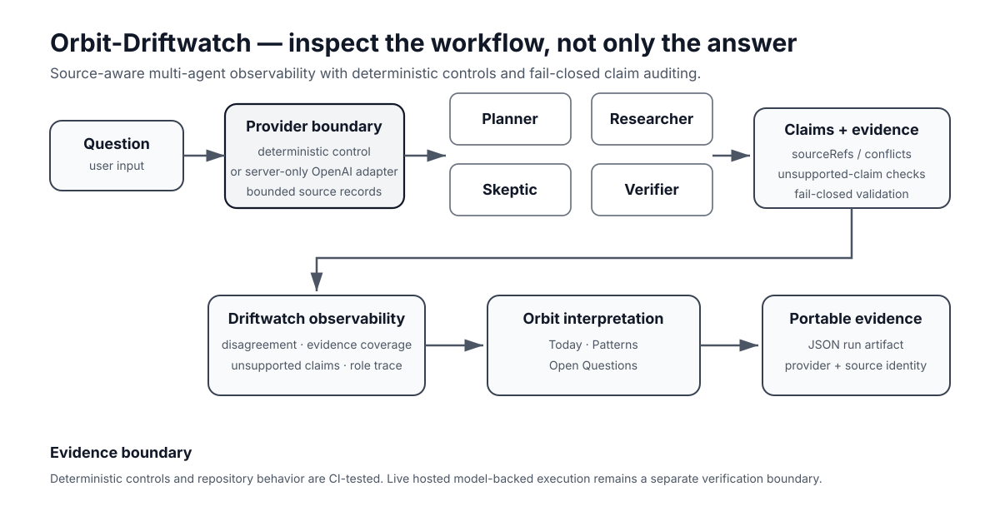

# Andrew // Ndr "Ender" Hensel

### AI Evaluation & Agentic Systems · Prompt Engineering · Governance & Provenance

I design, build, and evaluate AI systems with an emphasis on **multi-agent workflows, prompt/evaluation systems, provenance, reproducibility, failure-mode discovery, and fail-closed controls**.

My current professional direction includes **AI evaluation, prompt engineering, AI training, model/system quality, QA, and governance-aware agentic systems**.

> **What I focus on:** What did the system actually do, what evidence supports the claim, what failed, and what is it authorized to do next?

## What I can help a team do

- Design **AI evaluation harnesses** with known-answer controls, negative tests, failure modes, and clear pass/fail criteria.
- Test and improve **prompts, agent workflows, and structured-output pipelines** without confusing a passing demo with reliable behavior.
- Make **multi-agent systems observable** through role traces, disagreement, source bindings, provenance, and portable run artifacts.
- Add practical **governance and authorization controls** around high-impact or autonomous AI actions.
- Audit AI claims for **evidence quality, reproducibility, provenance, and unsupported state transitions**.

## Featured work

### [Orbit-Driftwatch](https://github.com/ndrorchestration/Orbit-Driftwatch) — multi-agent evaluation & observability

A compact portfolio showcase for inspecting a multi-agent workflow instead of showing only its final answer.

**Built:** explicit Planner / Researcher / Skeptic / Verifier roles, provider boundaries, source-aware provenance, disagreement and evidence-coverage metrics, unsupported/conflicting-claim handling, deterministic controls, portable run artifacts, and a fail-closed claim-readiness audit.

**Stack:** JavaScript · Node.js · browser UI · provider abstraction · OpenAI Responses adapter · GitHub Actions

**Evidence:** deterministic behavior and repository controls are CI-tested, including frozen reproducible artifacts. Live hosted OpenAI-backed execution/retrieval remains outside the currently verified public evidence boundary.

**Start here:** [five-minute evaluation path](https://github.com/ndrorchestration/Orbit-Driftwatch#five-minute-evaluation-path)

---

### [Intellectro](https://github.com/ndrorchestration/Intellectro) — governed social application

A social-network alpha exploring accountable human/AI interaction without silently transferring authority to agents.

**Built:** deny-by-default capability decisions, human approval gates, provenance and revision-aware Content Passport contracts, governed action records, correction/appeal paths, source-linked social content, authenticated application paths, and Supabase-backed persistence boundaries with RLS.

**Stack:** Next.js · React · Node.js · Supabase · Postgres/RLS · GitHub Actions · Vercel

**Evidence:** repository and database-governance surfaces are implemented and tested within their admitted scope. Production persistence configuration and browser/session verification remain separate open runtime gates; no broad production or security certification is claimed.

**Explore:** [repository](https://github.com/ndrorchestration/Intellectro) · [deployed application](https://intellectro.vercel.app)

---

### [DGAF-Framework](https://github.com/ndrorchestration/DGAF-Framework) / PDMAL — governed agentic-systems research

**DGAF (Dynamic Governance Agentic Formation)** is an experimental framework that treats capability, evidence, verification, authority, and permission to act as separate machine-relevant states.

**Built:** governance logic, provenance controls, deterministic validators, negative controls, CI, source/evidence binding, custody machinery, experimental tooling, and blinded-data infrastructure.

**Stack:** Python · GitHub Actions · deterministic validation · experimental/reproducibility tooling · governed evidence pipelines

**Current bounded research state:** Track A Epoch 002 collection is complete at **50 paired seed units / 2,250 blinded observations**, and dataset lock is established. Controlled materialization is not yet established; primary analysis is not authorized or run; scientific-N increment remains 0; canonical efficacy and independent validation are not established. Broader High-Assurance DGAF remains **PRE-FREEZE / FAIL-CLOSED / NOT AUTHORIZED / N=0**.

**Research status:** [DGAF repository](https://github.com/ndrorchestration/DGAF-Framework)

## Core capabilities & tools

| Area | Working focus |
|---|---|
| **AI evaluation & QA** | known-answer controls, negative testing, failure taxonomies, evidence classes, claim ceilings |
| **Prompt systems** | prompt/evaluation specs, structured outputs, failure-aware iteration, reproducible comparisons |
| **Agentic workflows** | role separation, handoffs, provider boundaries, state/control-plane design |
| **Governance & authorization** | fail-closed gates, capability boundaries, approval/rejection semantics |
| **Provenance & reproducibility** | source binding, artifact identity, deterministic controls, audit trails |
| **Runtime verification** | source/deployment/runtime separation, health checks, exact-identity reasoning |
| **Research tooling** | preregistered infrastructure, blinded workflows, computational reproduction, adversarial checks |

**Primary tools represented in current public work:** Python · JavaScript/Node.js · Next.js/React · Supabase/Postgres/RLS · GitHub Actions · Vercel · model/provider API integration

## More selected work

| Project | What it demonstrates |
|---|---|
| [ai-prompt-systems-portfolio](https://github.com/ndrorchestration/ai-prompt-systems-portfolio) | recruiter-readable prompt/evaluation specifications and structured prompt-system artifacts |
| [Driftwatch](https://github.com/ndrorchestration/Driftwatch) | drift instrumentation, failure-aware evaluation, reproducible synthetic benchmark apparatus |
| [agent-control-plane](https://github.com/ndrorchestration/agent-control-plane) | minimal capability dispatch, rejection provenance, manifests, and control-plane primitives |
| [resumeapex-eval](https://github.com/ndrorchestration/resumeapex-eval) | executable evaluation harnesses, known-answer controls, and deterministic reproduction |

## How I work

I try to keep these states separate instead of collapsing them into a generic “works” claim:

**defined → implemented → tested → computed → verified → independently verified → authorized → executed → empirically supported**

That means:

- a passing test does not by itself prove efficacy;
- a healthy deployment does not establish scientific validity;
- provenance establishes origin/history, not truth;
- governance controls do not automatically grant authorization;
- historical evidence does not silently transfer to a new candidate, deployment, run, or artifact.

Several repositories therefore intentionally preserve states such as **NOT VERIFIED**, **NOT AUTHORIZED**, **NOT ESTABLISHED**, or **blocked** when the required evidence does not exist yet.

## Current direction

I am especially interested in **AI Evaluator, Prompt Engineer, AI Training / Quality, and agentic-systems roles** where careful testing, failure-mode discovery, evidence quality, and system-level reasoning matter alongside implementation.

---

*This profile is a selected public portfolio, not an inventory of every repository or a substitute for project-local source of truth. Exact implementation, runtime, evidence, and governance facts remain authoritative in their owning repositories.*
